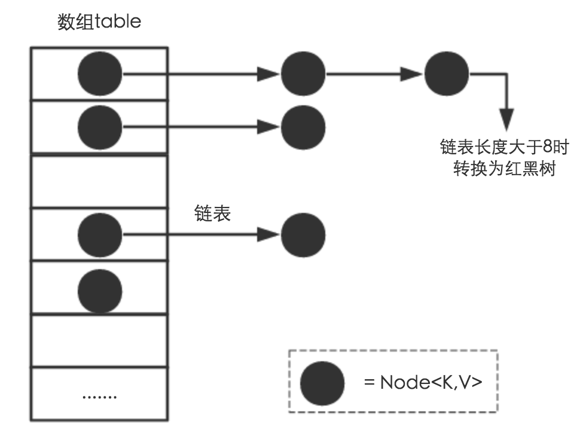
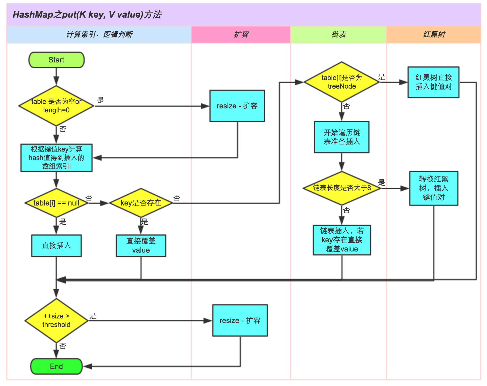

# 前言

HashMap是平时开发中非常常用的一个集合框架类，了解其内部构造及运行原理可以说是每一个Java程序员必不可少的，接下来就从源码一探究竟HashMap到底是什么样的类。

# 一、HashMap简介
HashMap是java.util包中的一个集合框架类，它是java.util.Map的实现类，具有方便、高效的基于键值对存取的功能，其平均查询时间复杂度为O(1)，非线性安全。

HashMap是一种用哈希表 + 链表 + 红黑树等数据结构实现的基于key-value存取的工具类，在JDK1.8之前没有红黑树这一数据结构，在JDK1.8之后对其进行了优化：**考虑到发生大量Hash碰撞时链表查询效率低，所以加入了红黑树这一数据结构以提高此种情况的查询效率，通过阈值控制，将链表和红黑树进行相互转化**。**同时JDK1.8还有一处优化，即hash扰动函数的优化，在JDK1.8之前hash()函数中对key的hash值扰动了四次，目的是降低hash碰撞的可能性，但是JDK1.8之后只进行了一次扰动，实现方式进行了简化**。



话不多说，接下来就直接进入源码解析部分吧

# 二、HashMap源码解读

温馨提示：阅读需耐心哦~~

## 1. 类定义
HashMap是Map类的实现类，同时继承了AbstractMap类、Cloneable类、Serializable类，后面两个标志性的接口赋予了它可克隆、可序列化的能力。

```java
//  HashMap类，继承自AbstractMap，实现了Map接口
//  并且实现了两个标志性接口，赋予了它可克隆、可序列化的能力
public class HashMap<K,V> extends AbstractMap<K,V>
    implements Map<K,V>, Cloneable, Serializable {
}
```

## 2. 常量定义

```java
//  序列化ID，作为唯一识别标志，用于序列化和反序列化    
private static final long serialVersionUID = 362498820763181265L;

//  默认初始化容量大小，为16
static final int DEFAULT_INITIAL_CAPACITY = 1 << 4; // aka 16

//  最大容量：2的30次方
static final int MAXIMUM_CAPACITY = 1 << 30;

//  负载因子，在扩容时使用
static final float DEFAULT_LOAD_FACTOR = 0.75f;

//  一个桶的树化阈值
//  当桶中元素个数超过这个值时，需要使用红黑树节点替换链表节点
static final int TREEIFY_THRESHOLD = 8;

//  一个树的链表还原阈值
//  当扩容时，桶中元素个数小于这个值，就会把树形的桶元素 还原（切分）为链表结构
static final int UNTREEIFY_THRESHOLD = 6;

//  哈希表的最小树形化容量
//  当哈希表中的容量大于这个值时，表中的桶才能进行树形化
//  否则桶内元素太多时会扩容，而不是树形化
//  为了避免进行扩容、树形化选择的冲突，
//  这个值不能小于 4 * TREEIFY_THRESHOLD
static final int MIN_TREEIFY_CAPACITY = 64;
```

## 3. 内部类Node
HashMap中有很多内部类，比如Node、TreeNode、KeySet、Values、EntrySet、HashIterator等，因为本文仅涉及增删改查操作，Node类、TreeNode类是其中操作的主要类，但是由于红黑树较为复杂，不是本文的重点，所以这里暂只解读Node类。

Node类是链表中存储的节点类，用于存储节点hash、key、value等信息，当然还有下一个节点的引用

```java
//  实际的存储节点内部类，可存在于红黑树也可存在于连表中
static class Node<K,V> implements Map.Entry<K,V> {
    final int hash; //  该节点的hash值
    final K key;    //  键
    V value;        //  值
    Node<K,V> next; //  下一个节点，树节点或连表节点

    //  构造函数
    Node(int hash, K key, V value, Node<K,V> next) {
        this.hash = hash;
        this.key = key;
        this.value = value;
        this.next = next;
    }

    //  获取键和值以及重写的toString方法等
    public final K getKey()        { return key; }
    public final V getValue()      { return value; }
    public final String toString() { return key + "=" + value; }

    //  重写hashCode方法
    public final int hashCode() {
        //  返回键的hash与值的hash求异或的结果，保证节点hash的唯一性
        return Objects.hashCode(key) ^ Objects.hashCode(value);
    }

    //  设置节点的值，返回旧值
    public final V setValue(V newValue) {
        V oldValue = value;
        value = newValue;
        return oldValue;
    }

    //  重写equals方法
    public final boolean equals(Object o) {

        //  如果该类和本类的内存地址相同则直接返回true
        if (o == this)
            return true;

        //  先判断是否是Map.Entry类型的类
        //  然后分别比较key和value是否相同
        //  如果都相同则返回true，否则返回false
        if (o instanceof Map.Entry) {
            Map.Entry<?,?> e = (Map.Entry<?,?>)o;
            if (Objects.equals(key, e.getKey()) &&
                Objects.equals(value, e.getValue()))
                return true;
        }
        return false;
    }
}
```

## 4. 静态工具方法

HashMap中提供了四个公告的静态工具方法，分别是hash、comparableClassFor、compareComparables、tableSizeFor。

* **hash**：hash扰动函数，用于计算出key的hash值，其中进行了一次扰动，以减少hash碰撞的概率。
```java
//  扰动函数，获取key的hash值
//  该方法相比于JDK7的四次位移已经做出了优化
//  只需1次位移即可实现，原理相同
static final int hash(Object key) {
    int h;
    //  如果key不为空
    //  那么就对key的hash进行一次16位无符号右位移异或混合然后返回
    //  这样扰动一次的目的是在于减少hash碰撞的概率
    //  具体优化讲解请移步：https://www.zhihu.com/question/20733617/answer/111577937
    return (key == null) ? 0 : (h = key.hashCode()) ^ (h >>> 16);
}
```

* **comparableClassFor**：用于检查某个对象是否可比较，在HashMap中多用于key的检查。其中对String进行了特判，String类实现了Comparable类，并且重写了Object的hashCode()和equals()方法，所以平常都建议大家用String类作为key。

```java
//  用于检查某个对象是否可比较，在HashMap中多用于key的检查
static Class<?> comparableClassFor(Object x) {
    //  先判断是否是Comparable类型的，如果不是则表明对象不可比较
    if (x instanceof Comparable) {
        Class<?> c; Type[] ts, as; Type t; ParameterizedType p;
        //  对String类型特判，如果是String类型直接返回该对象的Class类
        //  所以大多数人都建议在使用HashMap时key使用String类型
        if ((c = x.getClass()) == String.class) // bypass checks
            return c;
        //  获取该类实现的接口集，包含泛型参数信息
        //  前提是保证它实现了某些接口才有可能实现Comparable
        if ((ts = c.getGenericInterfaces()) != null) {
            //  循环遍历它实现的这些接口
            for (int i = 0; i < ts.length; ++i) {
                //  判断其是否支持泛型
                if (((t = ts[i]) instanceof ParameterizedType) &&
                //  判断承载该泛型信息的对象是否是Comparable类
                    ((p = (ParameterizedType)t).getRawType() ==
                        Comparable.class) &&
                //  获取其实际泛型列表，并且有且只有一个泛型类，即c
                //  c是传入对象x的类型
                    (as = p.getActualTypeArguments()) != null &&
                    as.length == 1 && as[0] == c) // type arg is c
                    return c;
            }
        }
    }
    return null;
}
```
* **compareComparables**：比较k和x，如果x和k不是同一种类型就返回0，如果是同一类型那么就返回其compareTo得到的值

```java
//  比较k和x，如果x和k不是同一种类型就返回0
//  如果是同一类型那么就返回其compareTo得到的值
@SuppressWarnings({"rawtypes","unchecked"}) // for cast to Comparable
static int compareComparables(Class<?> kc, Object k, Object x) {
    return (x == null || x.getClass() != kc ? 0 :
            ((Comparable)k).compareTo(x));
}
```
* **tableSizeFor**：跟据期望容量cap，计算2的n次方形式的哈希桶的实际容量。

```java
//  根据期望容量cap，返回2的n次方形式的哈希桶的实际容量 length。 
//  返回值一般会>=cap 
static final int tableSizeFor(int cap) {
    //  经过下面的 或 和位移 运算， n最终各位都是1。
    int n = cap - 1;
    n |= n >>> 1;
    n |= n >>> 2;
    n |= n >>> 4;
    n |= n >>> 8;
    n |= n >>> 16;
    //  判断n是否越界，返回 2的n次方作为 table（哈希桶）的阈值
    return (n < 0) ? 1 : (n >= MAXIMUM_CAPACITY) ? MAXIMUM_CAPACITY : n + 1;
}
```
## 5. 属性变量
HashMap中定义了六个属性变量，用于构建及管理hash表

```java
//  Hash表，是一个Node类型的数组，每一个数组元就是一个桶
//  在第一次被使用时初始化，同时扩容时会对其进行数组迁移等操作
transient Node<K,V>[] table;

    // 缓存Node节点的集合，用于记录被使用过的key和value的集合
transient Set<Map.Entry<K,V>> entrySet;

/**
    * The number of key-value mappings contained in this map.
    */
    // 已经存在的key-value对的数量
transient int size;

//  结构修改计数，rehash时会记录
//  因为hashmap也是线程不安全的，所以要保存modCount。用于fail-fast策略
transient int modCount;

//  调整容量的下一个大小值，其值等于 容量*负载因子
int threshold;

//  hash表的负载因子，用于计算哈希表元素数量的阈值。  
//  threshold = 哈希桶.length * loadFactor;
final float loadFactor;
```

## 6. 构造函数
```java
//  传入初始化容量和负载因子的构造函数
public HashMap(int initialCapacity, float loadFactor) {
    if (initialCapacity < 0)
        throw new IllegalArgumentException("Illegal initial capacity: " +
                                            initialCapacity);
    if (initialCapacity > MAXIMUM_CAPACITY)
        initialCapacity = MAXIMUM_CAPACITY;
    if (loadFactor <= 0 || Float.isNaN(loadFactor))
        throw new IllegalArgumentException("Illegal load factor: " +
                                            loadFactor);
    this.loadFactor = loadFactor;
    //  根据预期容量计算实际容量
    //  实际容量大小始终是大于等于预期容量的最小的2的次幂
    //  比如传入初始化容量是7，计算得到实际的容量是8，8是2的3次方
    this.threshold = tableSizeFor(initialCapacity);
}

public HashMap(int initialCapacity) {
    this(initialCapacity, DEFAULT_LOAD_FACTOR);
}

//  无参构造，默认初始化容量是16，负载因子是0.75
public HashMap() {
    this.loadFactor = DEFAULT_LOAD_FACTOR; // all other fields defaulted
}

//  构造一个新的HashMap，同时将传入的Map m的所有元素加入到表中
public HashMap(Map<? extends K, ? extends V> m) {
    this.loadFactor = DEFAULT_LOAD_FACTOR;
    putMapEntries(m, false);
}
```

其中批量注入元素的方法putMapEntries如下：

```java
//  将另一个Map的所有元素加入表中
//  参数evict初始化时为false
final void putMapEntries(Map<? extends K, ? extends V> m, boolean evict) {
    //  获取m元素的数量
    int s = m.size();
    //  数量大于0才进行操作
    if (s > 0) {
        //  如果此时hash表未初始化
        if (table == null) { // pre-size
            //  根据m中大小计算和负载因子，计算出阈值
            float ft = ((float)s / loadFactor) + 1.0F;
            //  修正阈值的边界 不能超过MAXIMUM_CAPACITY
            int t = ((ft < (float)MAXIMUM_CAPACITY) ?
                        (int)ft : MAXIMUM_CAPACITY);
            //  如果新的阈值大于当前阈值
            //  那么返回一个大于等于新的阈值的满足2的n次方的阈值
            if (t > threshold)
                threshold = tableSizeFor(t);
        }
        //  如果表格不为空，并且m的元素数量大于了当前容量阈值
        //  则进行resize扩容
        else if (s > threshold)
            resize();
        //  遍历 m 依次将元素加入当前表中
        for (Map.Entry<? extends K, ? extends V> e : m.entrySet()) {
            K key = e.getKey();
            V value = e.getValue();
            putVal(hash(key), key, value, false, evict);
        }
    }
}
```

## 7. 几个常规方法(不完整)

```java
//  经常使用的，获取hash表中已经存在的键值对数量
//  注意这里的size并非是hash表的大小，而是实际存在的键值对数量
public int size() {
    return size;
}

//  是否为空，即是否实际存在键值对（与table容量无关）
public boolean isEmpty() {
    return size == 0;
}
//  检测是否存在key
//  逻辑和get类似，主要是调用getNode方法
public boolean containsKey(Object key) {
    return getNode(hash(key), key) != null;
}
//  检测是否存在value
public boolean containsValue(Object value) {
    Node<K,V>[] tab; V v;
    //遍历哈希桶上的每一个链表
    if ((tab = table) != null && size > 0) {
        for (int i = 0; i < tab.length; ++i) {
            for (Node<K,V> e = tab[i]; e != null; e = e.next) {
                //如果找到value一致的返回true
                if ((v = e.value) == value ||
                    (value != null && value.equals(v)))
                    return true;
            }
        }
    }
    return false;
}
//  批量存入一个Map，逻辑和构造函数中相同，主要调用putMapEntries
public void putAll(Map<? extends K, ? extends V> m) {
    putMapEntries(m, true);
}
```

## 8. 查询方法 get()

根据key查询，找到返回value，没找到返回null

```java
//  根据key获取值
public V get(Object key) {
    Node<K,V> e;
    //  根据key的值和扰动后key的hash值先得到Node节点，然后获取其中的值
    return (e = getNode(hash(key), key)) == null ? null : e.value;
}

//  JDK8新增的方法，查询到则返回其value，没有则返回设定的缺省值
public V getOrDefault(Object key, V defaultValue) {
    Node<K,V> e;
    return (e = getNode(hash(key), key)) == null ? defaultValue : e.value;
}

//  根据扰动后的hash值和key的值获取节点
final Node<K,V> getNode(int hash, Object key) {
    Node<K,V>[] tab; Node<K,V> first, e; int n; K k;
    //  基本逻辑：先找到相应节点，然后返回，如果不存在返回null

    //  table不为空并且其大小大于0才继续
    if ((tab = table) != null && (n = tab.length) > 0 &&
        //  hash和n-1进行区域后定位到桶的位置，然后获取其头结点first
        (first = tab[(n - 1) & hash]) != null) {
        //  如果头结点恰好是该节点则直接返回
        //  检测内容：头节点的hash是否相同，key是否相同（检测内存地址或检测值）
        if (first.hash == hash && // always check first node
            ((k = first.key) == key || (key != null && key.equals(k))))
            return first;
        //  头结点不是要找的节点，接下来取得下一个节点进行寻找
        if ((e = first.next) != null) {
            //  如果桶内的数据结构是红黑树，那么就调用getTreeNode方法去查找
            if (first instanceof TreeNode)
                return ((TreeNode<K,V>)first).getTreeNode(hash, key);
            //  如果不是红黑树，即是连表，则循环遍历，直到查找到该节点
            do {
                if (e.hash == hash &&
                    ((k = e.key) == key || (key != null && key.equals(k))))
                    return e;
            } while ((e = e.next) != null);
        }
    }
    return null;
}
```

## 9. 插入/更新方法 put()



**向表中插入或更新一个值，其逻辑如下**：

1. 检查hash表是否初始化，如果没有就进行resize扩容
2. 根据key的扰动hash值定位到桶的位置，如果桶内为空，直接创建新的Node放入桶中
3. 如果桶不为空，则发生了hash碰撞，则进行下一步操作：
    * 如果桶内数据结构是红黑树，则以红黑树的形式遍历。如果key不存在则直接插入，如果key存在先获取到该节点
    * 如果桶内数据结构是链表，则以链表的形式循环遍历。如果遍历到尾节点仍无相同key存在，则直接插入，并且检测是否超过阈值，决定是否需要树化；如果key已经存在，则先获取该节点
4. 如果允许覆盖，则将之前找到的key对应的节点值进行覆盖，否则什么也不做
5. 修改操作计数、键值对数量等信息，并检测是否需要扩容，如果需要则进行resize

```java
//  插入新的值，主要调用putVal方法，详细逻辑见putVal()
public V put(K key, V value) {
    return putVal(hash(key), key, value, false, true);
}

//  插入新值核心函数
//  如果参数onlyIfAbsent是true，那么不会覆盖相同key的值value
//  如果evict是false，表示是在初始化时调用的
final V putVal(int hash, K key, V value, boolean onlyIfAbsent,
                boolean evict) {
    Node<K,V>[] tab; Node<K,V> p; int n, i;
    //  首先检查table是否是null并且容量是否大于0，即有没有初始化table
    //  如果没有初始化就进行resize扩容
    if ((tab = table) == null || (n = tab.length) == 0)
        n = (tab = resize()).length;
    //  先定位到桶的位置，p为该桶的头节点
    //  如果p为null则说明该桶还没有节点，直接将新键值对存入桶中
    if ((p = tab[i = (n - 1) & hash]) == null)
        tab[i] = newNode(hash, key, value, null);
    //  桶内头节点p不为空，即发生了hash碰撞，进一步处理
    else {
        Node<K,V> e; K k;
        //  比较头节点的扰动hash值及key值
        //  如果相同则说明存入的节点key已存在，而且就是头节点
        //  先获取该节点，是否覆盖其值进一步处理
        if (p.hash == hash &&
            ((k = p.key) == key || (key != null && key.equals(k))))
            e = p;
        //  头节点的key和插入的key不相同
        //  先判断桶内数据结构是否是红黑树，如果是则以红黑树的方式插入到树中
        else if (p instanceof TreeNode)
            e = ((TreeNode<K,V>)p).putTreeVal(this, tab, hash, key, value);
        //  桶内节点不是红黑树，即链表结构
        else {
            //  循环遍历该链表
            //  直到找到与插入节点key相同的节点，没找到就直接插入到尾结点
            for (int binCount = 0; ; ++binCount) {
                //  已经遍历到了尾节点，说明插入的key不存在，直接插入到尾部
                if ((e = p.next) == null) {
                    p.next = newNode(hash, key, value, null);
                    //  如果桶内节点数量达到了树型化阈值，则进行树型化
                    if (binCount >= TREEIFY_THRESHOLD - 1) // -1 for 1st
                        treeifyBin(tab, hash);
                    break;
                }
                //  插入的key已经存在，先获取该节点，是否覆盖其值进一步处理
                if (e.hash == hash &&
                    ((k = e.key) == key || (key != null && key.equals(k))))
                    break;
                p = e;
            }
        }
        //  如果获取到的节点不为null则进行操作
        if (e != null) { // existing mapping for key
            V oldValue = e.value;
            //  方法传入的onlyIfAbsent参数为false，或者旧值为null则直接替换掉旧值
            if (!onlyIfAbsent || oldValue == null)
                e.value = value;
            //  这是一个空实现的函数，用作LinkedHashMap重写使用
            afterNodeAccess(e);
            return oldValue;
        }
    }

    //  以上操作以及全部完成，并且已经成功插入或更改一个节点的值
    //  修改modCount的值，记录修改次数
    ++modCount;
    //  更新size，并判断如果超过了阈值则进行扩容
    if (++size > threshold)
        resize();
    //  这是一个空实现的函数，用作LinkedHashMap重写使用
    afterNodeInsertion(evict);
    return null;
}
```

## 10. 桶的树形化 treeifyBin()

如果一个桶中的元素个数超过 TREEIFY_THRESHOLD(默认是 8 )，就使用红黑树来替换链表，提高查询效率

```java
//将桶内所有的链表节点替换成红黑树节点
final void treeifyBin(Node[] tab, int hash) {
    int n, index; Node e;
    //如果当前哈希表为空，或者哈希表中元素的个数小于进行树形化的阈值(默认为 64)，就去新建/扩容
    if (tab == null || (n = tab.length) < MIN_TREEIFY_CAPACITY)
        resize();
    else if ((e = tab[index = (n - 1) & hash]) != null) {
        //如果哈希表中的元素个数超过了树形化阈值，进行树形化
        // e 是哈希表中指定位置桶里的链表节点，从第一个开始
        TreeNode hd = null, tl = null; //红黑树的头、尾节点
        do {
            //新建一个树形节点，内容和当前链表节点 e 一致
            TreeNode p = replacementTreeNode(e, null);
            if (tl == null) //确定树头节点
                hd = p;
            else {
                p.prev = tl;
                tl.next = p;
            }
            tl = p;
        } while ((e = e.next) != null);  
        //让桶的第一个元素指向新建的红黑树头结点，以后这个桶里的元素就是红黑树而不是链表了
        if ((tab[index] = hd) != null)
            hd.treeify(tab);
    }
}
```

## 11. 扩容

resize是**非常重要**的一个函数，它负责了HashMap中动态扩容的核心逻辑，其主要逻辑如下：

1. 备份旧表、旧表容量、旧表阈值，定义新表的容量、阈值
2. 如果旧表容量大于0
    * 如果旧表容量已经达到上限，则设置阈值为最大整数，不再进行扩容
    * 如果旧表容量未达上限，设置新表容量为旧表容量的2倍，但前提是新表容量也得在上限范围内
3. 如果旧表容量为空，但是阈值大于0，说明初始化时指定了容量和阈值，旧表的阈值则作为新表的容量
4. 如果旧表容量为空，并且阈值为0，说明初始化时没有指定容量和阈值，则将默认的初始容量和阈值作为新表的容量和阈值
5. 如果以上操作之后新表的阈值为0，根据新表容量和负载因子求出新表的阈值
6. 创建一个新的表，其数组长度为新表容量
7. 如果旧表不为空，就进行数据迁移，迁移时依次遍历每个桶
    * 如果桶中只有一个节点，则直接放入新表对应位置的桶中
    * 如果桶中不止一个节点，并且结构是红黑树，则进行拆分红黑树然后迁移
    * 如果桶中不止一个节点，并且结构是链表，则分为高位和低位分别迁移（高位=  低位 + 原哈希桶容量），低位放入新表对应旧表桶索引中，高位放入新表对应新的桶索引中
8. 返回新表

```java
//  hash扩容核心函数
final Node<K,V>[] resize() {
    //  先存一个旧table
    Node<K,V>[] oldTab = table;
    //  旧table的容量
    int oldCap = (oldTab == null) ? 0 : oldTab.length;
    //  旧table的阈值
    int oldThr = threshold;
    //  定义新table的容量和阈值
    int newCap, newThr = 0;
    //  如果旧table容量大于0
    if (oldCap > 0) {
        //  旧table容量已经达到上限，则设置阈值为最大整数，不再进行扩容
        if (oldCap >= MAXIMUM_CAPACITY) {
            threshold = Integer.MAX_VALUE;
            return oldTab;
        } //  容量未达到上限，新table容量是旧table的2倍（前提是在上限范围内）
        else if ((newCap = oldCap << 1) < MAXIMUM_CAPACITY &&
                    oldCap >= DEFAULT_INITIAL_CAPACITY)
            newThr = oldThr << 1; // double threshold
    }// 表示空的，但是阈值大于0，说明初始化时指定了容量、阈值
    else if (oldThr > 0) // initial capacity was placed in threshold
        newCap = oldThr;//  则直接把旧阈值作为新table的容量
    else {  // 既没有初始化容量又没有初始化阈值，那么就进行初始化
        newCap = DEFAULT_INITIAL_CAPACITY;
        newThr = (int)(DEFAULT_LOAD_FACTOR * DEFAULT_INITIAL_CAPACITY);
    }
    if (newThr == 0) {
        float ft = (float)newCap * loadFactor;//根据新table容量和加载因子求出新的阈值
        newThr = (newCap < MAXIMUM_CAPACITY && ft < (float)MAXIMUM_CAPACITY ?
                    (int)ft : Integer.MAX_VALUE);//   进行越界限定
    }
    //  更新阈值
    threshold = newThr;
    //  创建一个新的table
    @SuppressWarnings({"rawtypes","unchecked"})
        Node<K,V>[] newTab = (Node<K,V>[])new Node[newCap];
    //  把新的table直接赋值给table，原来存放值的table内存是被oldTab变量所指向
    table = newTab;
    //  如果旧table不为空，那么就进行节点迁移
    if (oldTab != null) {
        for (int j = 0; j < oldCap; ++j) {
            Node<K,V> e;
            //  依次获取旧table中桶中的首节点
            if ((e = oldTab[j]) != null) {
                oldTab[j] = null;// 清理旧表中该桶的内存空间，防止内存泄漏
                if (e.next == null)//   如果桶中只有一个节点，直接存入新table中
                    newTab[e.hash & (newCap - 1)] = e;
                else if (e instanceof TreeNode)//   桶中不止一个节点，并且结构是红黑树，则进行拆分
                    ((TreeNode<K,V>)e).split(this, newTab, j, oldCap);
                else { // preserve order
                    //  因为扩容是容量翻倍，所以原链表上的每个节点
                    //  现在可能存放在原来的下标，即低位， 
                    //  或者扩容后的下标，即高位。 
                    //  高位=  低位 + 原哈希桶容量

                    //  低位链表的头结点、尾节点
                    Node<K,V> loHead = null, loTail = null;
                    //  高位链表的头结点、尾节点
                    Node<K,V> hiHead = null, hiTail = null;
                    Node<K,V> next;
                    do {
                        next = e.next;
                            // 利用哈希值和旧的容量取与，可以得到哈希值去模后，是大于等于oldCap还是小于oldCap
                            // 等于0代表小于oldCap，应该存放在低位，否则存放在高位
                        if ((e.hash & oldCap) == 0) {
                            if (loTail == null)
                                loHead = e;
                            else
                                loTail.next = e;
                            loTail = e;
                        }// 高位则处理和低位相反
                        else {
                            if (hiTail == null)
                                hiHead = e;
                            else
                                hiTail.next = e;
                            hiTail = e;
                        }
                    } while ((e = next) != null);
                    //  低位链表存放在原来的桶索引中
                    if (loTail != null) {
                        loTail.next = null;
                        newTab[j] = loHead;
                    }
                    //  高位链表存放在新的桶索引中
                    if (hiTail != null) {
                        hiTail.next = null;
                        newTab[j + oldCap] = hiHead;
                    }
                }
            }
        }
    }
    return newTab;
}
```

## 12. 删除节点 remove()

删除操作是根据key先找到对应的Node节点，然后再删除，如果没找到直接返回null，其操作和get()非常相似

```java
//  根据key删除一个节点，其主要是调用removeNode方法
public V remove(Object key) {
    Node<K,V> e;
    return (e = removeNode(hash(key), key, null, false, true)) == null ?
        null : e.value;
}

//  删除节点的核心方法
//  如果参数matchValue是true，则必须key、value都相等才删除。 
//  如果movable参数是false，在删除节点时，不移动其他节点
final Node<K,V> removeNode(int hash, Object key, Object value,
                            boolean matchValue, boolean movable) {
    Node<K,V>[] tab; Node<K,V> p; int n, index;
    //  在删除之前先确认表是否为空，并且其容量大于0
    //  同时根据key定位到桶位置中桶不为空
    if ((tab = table) != null && (n = tab.length) > 0 &&
        (p = tab[index = (n - 1) & hash]) != null) {
        Node<K,V> node = null, e; K k; V v;
        //  如果头结点就是要删除的节点，则直接赋值给node
        if (p.hash == hash &&
            ((k = p.key) == key || (key != null && key.equals(k))))
            node = p;
        //  如果还存在后续节点就继续寻找要删除的节点
        else if ((e = p.next) != null) {
            //  如果桶内数据结构是红黑树，则在红黑树中找出该节点
            if (p instanceof TreeNode)
                node = ((TreeNode<K,V>)p).getTreeNode(hash, key);
            else {
                //  如果是链表，则循环遍历查找
                //  注意此时p是删除节点的前驱节点，node是被删除的节点
                do {
                    if (e.hash == hash &&
                        ((k = e.key) == key ||
                            (key != null && key.equals(k)))) {
                        node = e;
                        break;
                    }
                    p = e;
                } while ((e = e.next) != null);
            }
        }
        //  如果要删除的节点找到了，就进行删除操作，否则返回null
        //  matchValue是true则要求key和value都必须相等
        if (node != null && (!matchValue || (v = node.value) == value ||
                                (value != null && value.equals(v)))) {
            //  根据不同的数据结构进行删除相应的节点
            if (node instanceof TreeNode)
                ((TreeNode<K,V>)node).removeTreeNode(this, tab, movable);
            else if (node == p)
                tab[index] = node.next;
            else
                p.next = node.next;
            ++modCount;//  记录修改数
            --size;//  键值对数量-1
            afterNodeRemoval(node);//  这是一个空实现的函数，LinkedHashMap回调函数
            return node;
        }
    }
    return null;
}
```

# 总结

HashMap的设计真的非常优秀，**包括数组+链表+红黑树的组合、大量使用位运算提高效率、hash扰动减少碰撞等**。不过HashMap最大的弊端就是不自持多线程，它的非线程安全性导致它无法在并发环境下有很好的表现，甚至会有出现致命的情况（比如resize造成死锁）。HashTable虽然是线程安全，但是它的并发性能却不见得很好，而ConcurrentHashMap则很好地弥补了这一短板，它在并发环境下有非常优秀的表现，后续小编也会出一篇JDK8的ConcurrentHashMap源码解读文章，和大家一起学习一下它在HashMap的基础上又进行了哪些优化。